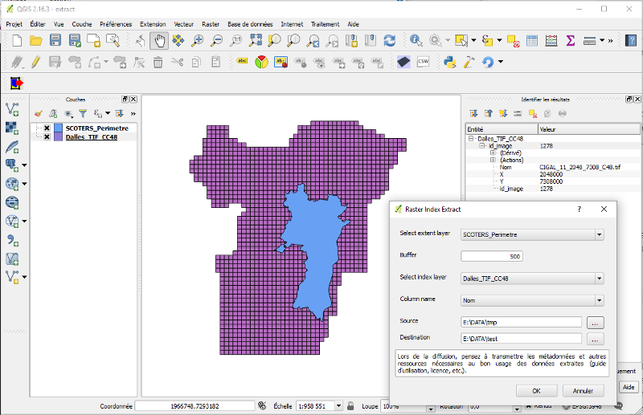
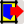
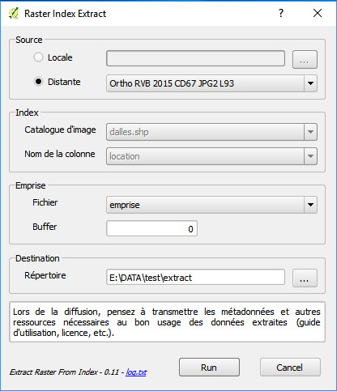

# Extract raster from index

RasterIndexExtract est une extension (plugin) QGIS qui permet d'extraire un ensemble de dalles d'un raster à partir d'un catalogue d'images (index) et d'une emprise.
Il permet également de télécharger des raster distants vai FTP. Il est par défaut configuré pour télécharger les données raster ouvertes de GéoGrandEst publiées par la Région Grand Est.

## Installation

-  et dézipper le code du plugin sur votre ordinateur dans un répertoirte nommé `ExtractRasterFromIndex`
- Placer le dossier résultant (`RasterIndexExtract`) dans le répertoire des plugins QGIS (généralement de la forme `utilisateurs/user/.qgis2/python/plugins`)

## Utilisation

Le plugin propose 2 modes via la section source:
- `Locale`: utilisation en mode desktop (extraction de données locales)
- `Distante`: utilisation en mode distant (téléchargement via FTP)

Seules les couches affichées dans QGIS (cochées) sont proposées comme couche d'index et d'emprise dans le plugin.

### Mode desktop (extraction de données locales)

#### Requis

- Un raster découpé sous forme de dalles, stocké dans un dossier unique sans arborescence
- Un fichier d'index des images raster (catalogue d'images avec un champ correspondant au nom de chaque dalle)
- Un fichier d'emprise d'extraction

**NB:** Pour le bon fonctionnement du plugin, il est important que le système de projection des fichiers soit correctement défini et strictement identique pour le fichier d'index et celui d'emprise.

#### Utilisation

- Chargez le fichier du catalogue d'images (index) dans QGIS
- Chargez le fichier d'emprise dans QGIS
- Ouvrez le plugin "RasterIndexExtract" (bouton )
- Renseignez les différents champs demandés (tous sont obligatoires)
- Cliquez sur OK pour démarrer l'extraction. Une barre de progression s'affiche en haut de page permettant de suivre la lecture et copie des fichiers

#### Liste des paramètres

- Section **Index**:
    - `Catalogue d'image` - couche du catalogue d'images
    - `Nom de colonne` - nom de la colonne attributaire de la couche d'index contenant le nom des images
- Section **Emprise**:
    - `Fichier` - couche d'emprise à extraire
    - `Buffer` - buffer autour de l'emprise à ajouter (en mètres)
- Section **Destination**:
    - `Répertoire` - répertoire de destination pour les images extraites

### Mode distant (téléchargement via FTP)

Par défault, dans ce mode le plugin est configuré pour proposer les images de GéoGrandEst mises à disposition par le Région GrandEst.

En cas d'interruption du téléchargement des données:
- Le téléchargement se poursuit jusqu'à récupération complète du fichier en cours
- Le lancement d'dun nouveau téléchargement dans le même dossier efface le dernier fichier téléchargé s'il est incomplet et poursuite le téléchargement.

**Ce mode n'est pas fait pour télécharger l'ensemble d'un département. Si la zone de travail est très grande, utilisez directement le protocole FTP.**

#### Requis

- Un fichier d'emprise d'extraction
- Une bonne connexion internet
- Un peu de patience

**NB:** Pour le bon fonctionnement du plugin, il est important que le système de projection de l'emprise soit en Lambert 93. En cas de dysfonctionnement, reprojetez la couche via QGIS.

#### Utilisation

- Chargez le fichier d'emprise dans QGIS
- Ouvrez le plugin "RasterIndexExtract" (bouton )
- Renseignez les différents champs demandés
- Cliquez sur OK pour démarrer l'extraction. Une barre de progression s'affiche en haut de page permettant de suivre la lecture et copie des fichiers

#### Liste des paramètres

- Section **Emprise**:
    - `Fichier` - couche d'emprise à extraire
    - `Buffer` - buffer autour de l'emprise à ajouter (en mètres)
- Section **Destination**:
    - `Répertoire` - répertoire de destination pour les images extraites

### Recommandations

Ce plugin est en cours de développement (expérimental), des dysfonctionnements peuvent appraître. Merci de nous transmettre vos retours d'expérience.

En cas de problème, si un message d'erreur apparaît, il peut-être nécessaire de redémarrer QGIS pour s'assurer du bon fonctionnement du plugin.

Pour le bon fonctionnement du plugin, il est important que le système de projection de l'emprise soit le même que celui des données à extraire (Lambert 93 pour les données FTP proposées par la Région Grand Est). En cas de dysfonctionnement, reprojetez la couche via QGIS.

Selon la puissance de votre ordinateur et la bande passante de votre connexion internet, des temps de latences peuvent appraître au début de l'extraction. Cela influe aussi naturellement beaucoup sur le temps de téléchargement.

Pensez, lors de la diffusion à transmettre les métadonnées et l'ensemble des ressources nécessaires au bon usage des données extraites (licence, guide d'utilisation etc.).
